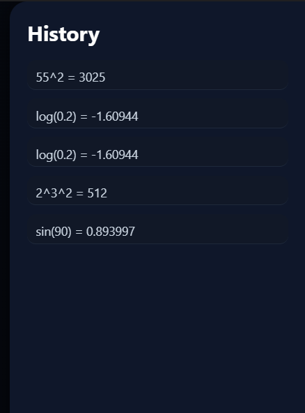

# Mini Interpreter Calculator

A full-stack scientific calculator built from scratch in **C**, featuring a custom tokenizer, recursive descent parser, and AST-based evaluator — wrapped with a modern Flask web UI and optional desktop interface.

---

## Features

### 1. Core Engine (C Backend)

- Custom **Tokenizer**
- Recursive Descent **Parser**
- AST-based **Expression Evaluation**
- Operator precedence handling
- Right-associative exponentiation (`2^3^2 = 512`)
- Modulo support (`%`)
- Unary minus support
- Built-in constant:
  - `pi`
- Scientific functions:
  - `sin`
  - `cos`
  - `tan`
  - `log`
  - `sqrt`
- Degree / Radian mode support
- Division & modulo safety checks

---

### 2. Web Interface (Flask)

- Dark / Light theme toggle
- Memory operations:
  - `MC`
  - `MR`
  - `M+`
- Slide-out history panel
- Ripple button animations
- Keyboard support
- Modern responsive UI
- Backend integration via `/evaluate` API

---

### 3. Desktop Wrapper

- Python-based GUI wrapper
- Executes compiled C backend
- Cross-platform compatible

---

## Architecture

```
User Input
   ↓
Tokenizer (C)
   ↓
Parser (C)
   ↓
AST
   ↓
Evaluator (C)
   ↓
Flask API (/evaluate)
   ↓
Web UI
```

---

## Project Structure

```
mini-interpreter-calculator/
│
├── backend/
│   ├── main.c
│   ├── tokenizer.c
│   ├── tokenizer.h
│   ├── parser.c
│   └── parser.h
│
├── web/
│   ├── server.py
│   ├── templates/
│   │   └── index.html
│   └── static/
│       └── style.css
│
├── gui.py
├── README.md
└── LICENSE
```

---

## How to Run?

### 1.Compile C Backend

```bash
gcc main.c tokenizer.c parser.c -o calc -lm
```

Run:

```bash
./calc
```

---

### 2. Run Flask Web App

```bash
pip install flask
python server.py
```

Open:

```
http://127.0.0.1:5000
```

---

## Example Expressions

```
2+3*4
(2+3)*4
2^3^2
10%3
sin(90)
sqrt(25)
log(1)
pi
```

---

## <u>Why This Project Is Interesting</u>

- Built a mathematical interpreter from scratch  
- Implemented recursive grammar parsing  
- Managed operator precedence & associativity  
- Integrated low-level C backend with Flask web server  
- Designed custom UI with memory & history features  

---
## 📸 Screenshots

### Dark Mode


### History Panel


### Light Mode

### Scientific Functions

---
## License
MIT License

